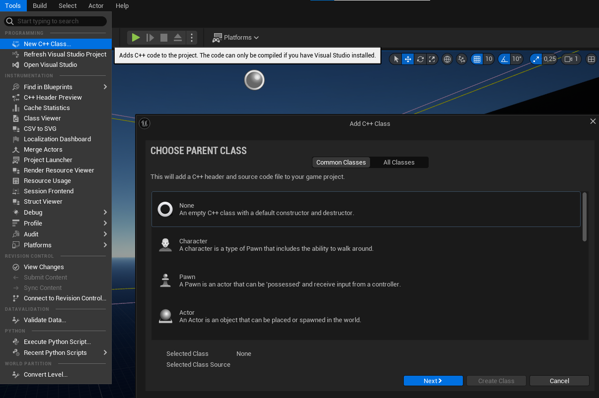
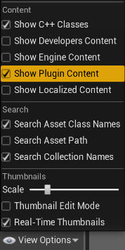
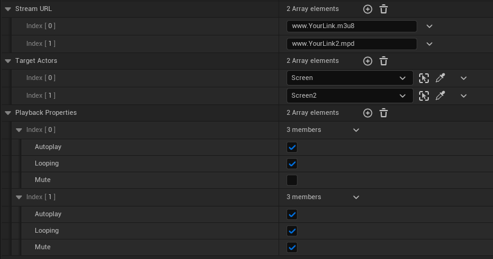
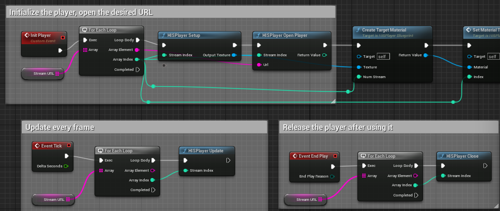

# Meta Quest Set Up Guide

## Import HISPlayer SDK
Extract the SDK from the .zip file, copy the `HISPlayer` folder and paste into the `Plugins/` directory in your project’s root (If that directory doesn’t exist, create one).

<p align="center">
  
</p>

Then, go into the `HISPlayer` directory and open the `HISPlayer.uplugin` file. You need to check that the **Engine Version** in this file matches the Unreal Engine version of your project.

> ⚠ Don’t worry about the full version number. The **Engine Version** field only cares about the **major** and **minor** version numbers. Ignore the patch number.

Example:
1. Suppose your project uses **Unreal Engine 5.5.4**.  
2. Open `HISPlayer.uplugin`.  
3. Locate the field `"Engine Version"`.  
4. Enter only the **major** and **minor** numbers: `5.5.0`.  
   - ✅ Correct: `5.5.0`  
   - ❌ Incorrect: `5.5.4` (the patch number `.4` will be ignored anyway)  

This ensures that HISPlayer is recognized as compatible with your Unreal Engine project.  

If you are unsure, always use `X.Y.0` where `X` is the major version and `Y` is the minor version of your Unreal Engine.

<p align="center">

</p>

Open your project and go into **Edit > Plugins**, look for the `HISPlayer` plugin and if it’s disabled, enable it and restart the project.

<p align="center">

</p>

## Set Default Build Settings Version
It is preferable to use the HISPlayer SDK in a C++ project, rather than in an only blueprint one. To create a C++ project from an only blueprint project, go to **Tools > New C++ Class** and follow the indications to create a new one. Any kind of C++ parent class will work.

<p align="center">

</p>

Make sure that the `YourProjectName.Target.cs` and `YourProjectNameEditor.Target.cs` scripts located in the `Source` directory have the following setup:

```
public class HISPlayerVRSampleTarget : TargetRules
{
	public HISPlayerVRSampleTarget(TargetInfo Target) : base(Target)
	{
#if UE_5_7_OR_LATER
		Type = TargetType.Game;
		DefaultBuildSettings = BuildSettingsVersion.V6;
		IncludeOrderVersion = EngineIncludeOrderVersion.Unreal5_7;
		ExtraModuleNames.Add("HISPlayerVRSample");
#elif UE_5_4_OR_LATER
		Type = TargetType.Game;
		DefaultBuildSettings = BuildSettingsVersion.V5;
		IncludeOrderVersion = EngineIncludeOrderVersion.Unreal5_4;
		ExtraModuleNames.Add("HISPlayerVRSample");
#else
		Type = TargetType.Game;
        DefaultBuildSettings = BuildSettingsVersion.V2;
        ExtraModuleNames.AddRange(new string[] { "HISPlayerVRSample" });
#endif
    }
}
```

```
public class HISPlayerVRSampleEditorTarget : TargetRules
{
	public HISPlayerVRSampleEditorTarget(TargetInfo Target) : base(Target)
	{
#if UE_5_7_OR_LATER
		Type = TargetType.Editor;
		DefaultBuildSettings = BuildSettingsVersion.V6;
		IncludeOrderVersion = EngineIncludeOrderVersion.Unreal5_7;
		ExtraModuleNames.Add("HISPlayerVRSample");
#elif UE_5_4_OR_LATER
		Type = TargetType.Editor;
		DefaultBuildSettings = BuildSettingsVersion.V5;
		IncludeOrderVersion = EngineIncludeOrderVersion.Unreal5_4;
		ExtraModuleNames.Add("HISPlayerVRSample");
#else
		Type = TargetType.Editor;
        DefaultBuildSettings = BuildSettingsVersion.V2;
        ExtraModuleNames.AddRange(new string[] { "HISPlayerVRSample" });
#endif
    }
}
```

The `HISPlayerSample` and `HISPlayerVRSample` are C++ projects which already include this lines of code so, in case you are using them, you can skip to the next section.

## Import BP_HISPlayer
To use HISPlayer’s functionalities in your Level, you need to add the `BP_HISPlayer`. It is located inside `Content Browser > HISPlayer Content > Blueprint`.

<p align="center">

</p>

If you can’t find the `HISPlayer Content` directory in the Content Browser, check **“Show Plugin Content”** in **View Options**.

<p align="center">

</p>

Add the `BP_HISPlayer`.

<p align="center">
  
</p>

To render the content, you need to set an actor with `M_HISPlayerMat` as Material.

<p align="center">
  
</p>

## Configure HISPlayer multistream properties
Set the player’s parameters as desired in your `BP_HISPlayer` actor for single stream and multistream.
It is possible to add more than one stream using one instance of the `BP_HISPlayer`, by adding more elements to the **Stream URL** and **Target Actors** arrays.

<p align="center">

</p>

You can modify the behavior of the `BP_HISPlayer` as desired or use a custom blueprint, as long as it follows the original structure.

<p align="center">

</p>

Use the **HISPlayer API** to add your own implementation.

## License Key

Input the license key that is associated with the SDK. If the license key is not valid, the player won’t work and will throw an error message.

To find this field, go to the Level Outliner and look for the `BP_HISPlayer` actor. Then, in the **Details** window, locate the **HISPlayer** section.

<p align="center">

</p>

## Configure Android Project Settings
Please go to **Edit > Project Settings > Platforms > Android**.

Make sure that you have clicked **Configure Android Settings**.
<p align="center">

</p>

## HISPlayer VR Sample
### Download the Sample
Please, download the sample here: [**HISPlayer VR Sample**](https://downloads.hisplayer.com/Unreal/Quest/HISPlayerVRSample_1.0.3.zip) (no need to download it if you have received it in the email).

### Import HISPlayer SDK
Please use HISPlayer SDK and above with **Vulkan** support.

If you have not imported HISPlayer SDK yet, please follow the [Setup Guide](./setup-guide.md).
Extract the SDK from the .zip file, copy the `HISPlayer` folder and paste into the `HISPlayerVRSample\Plugins` directory.

### Using the Sample
The HISPlayer VR Sample default UE version is 5.5. If you want to update it to a higher UE version, please do the following:
- Right click on the `HISPlayerVRSample.uproject` file, select the option **"Switch Unreal Engine Version"** and select your UE version.

Open `HISPlayerVRSample.uproject`.

### Available Levels
Once the project is opened, you should be inside the `HISPlayerVRLevel` map. You can select other levels from `Content Browser > HISPlayerResources > Levels`:
- `HISPlayerVR180StereoscopicLevel`
- `HISPlayerVR360Level`
- `HISPlayerVRLevel`
- `HISPlayerVRLevelMultistream`
- `HISPlayerVRStereoscopicLevel`

<p align="center">
  
</p>

For scenes `HISPlayerVR360Level` and `HISPlayerVR180StereoscopicLevel`, the meshes `SM_HISPlayer_Sphere` and `SM_HISPlayer_180Sphere` are used as actors to render the videos. These actors are attached to `BP_HISPlayer`.

<p align="center">
  
</p>

### Sample Description
The HISPlayer VR Sample is made based on the Unreal Engine [Virtual Reality Template](https://dev.epicgames.com/documentation/en-us/unreal-engine/vr-template-in-unreal-engine?application_version=5.3)

The important UI components are located in `HISPlayerVRSample\Content\HISPlayerResources\UI`:
- `HISPlayer_UI.uasset`: Widget Blueprint of the video playback control UI
- `HISPlayer_UI_Actor.uasset`: Blueprint class to place the `HISPlayer_UI` widget to VR space. The `HISPlayer_UI` is attached as a widget component.
- `HISPlayer_UI_OnClick.uasset`: Represents an abstract game action for `HISPlayer_UI` that can be mapped to Meta Quest left and right hand controllers 

<p align="center">
  
</p>

The HISPlayer UI components are connected to the default VRTemplate's device input action mapping (`IMC_Default`) and Blueprint class (`VRPawn`):
- `HISPlayerVRSample\Content\VRTemplate\Input\IMC_Default.uasset`: The `HISPlayer_UI_OnClick` is mapped in this input mapping context asset. It represents the Meta Quest left and right hand controllers input action for `HISPlayer_UI`.
<p align="center">
  
</p>

- `HISPlayerVRSample\Content\VRTemplate\Blueprints\VRPawn.uasset`: a Pawn is the physical representation of the user and defines how the user interacts with the virtual world. In the VR Template, the Pawn contains the logic for input events from the motion controllers. You can also control the behavior of Meta Quest left and right hand controller through `WidgetInteractionLeft` and `WidgetInteractionRight`. The Blueprint also controls the UI interaction with the Meta Quest left and right hand controllers emulating the left-mouse click. 
<p align="center">
  
</p>
